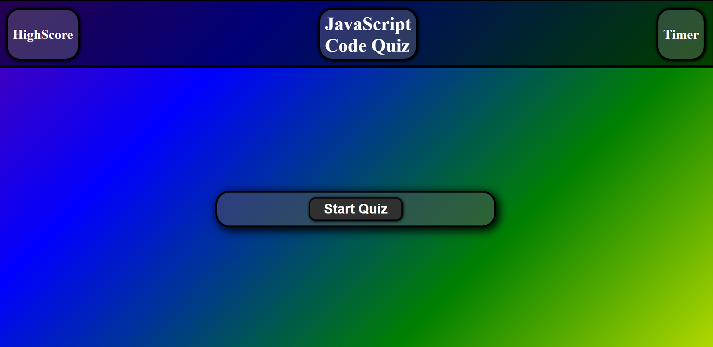
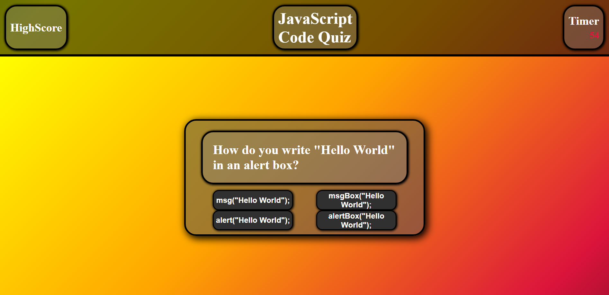
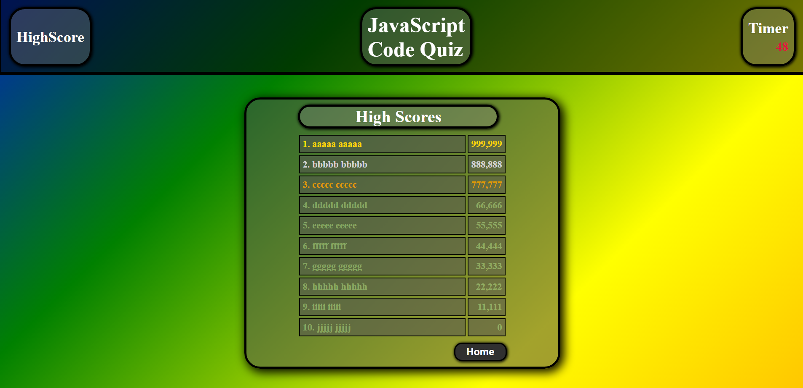

# Challenge-04-Code-Quiz

JavaScript Code Quiz

## Description

This is a JavaScript Code quiz that is designed to test my knowledge of JavaScript.  The event starts with 1 simple button, once clicked, will begin displaying the questions.  You have 1 minute to complete the quiz.  GOOD LUCK!

## Table of Contents (Optional)

- [Installation](#installation)
- [Usage](#usage)
- [Credits](#credits)
- [License](#license)

## Installation

No installation required.

## Usage

This webpage is to be viewed at https://jk377y.github.io/Challenge-04-Code-Quiz/ 

## Credits

Fabien Moreno @ https://www.linkedin.com/in/fabien-moreno/
For collaboration, ideas and assistance.

Stefan Mischook @ https://www.youtube.com/c/StefanMischook for walkthroughs and explanation of JavaScript functions.

Mosh Hamedani @ https://www.codewithmosh.com for instructional videos on relavent topics.

W3 Schools @ https://validator.w3.org/ For use of HTML validator tool.

Mozilla @ https://developer.mozilla.org/en-us For reference for technical writing and structure.

## License

MIT License

Copyright (c) 2022 James Kelly

Permission is hereby granted, free of charge, to any person obtaining a copy of this software and associated documentation files (the "Software"), to deal in the Software without restriction, including without limitation the rights to use, copy, modify, merge, publish, distribute, sublicense, and/or sell copies of the Software, and to permit persons to whom the Software is furnished to do so, subject to the following conditions:

The above copyright notice and this permission notice shall be included in all copies or substantial portions of the Software.

THE SOFTWARE IS PROVIDED "AS IS", WITHOUT WARRANTY OF ANY KIND, EXPRESS OR IMPLIED, INCLUDING BUT NOT LIMITED TO THE WARRANTIES OF MERCHANTABILITY, FITNESS FOR A PARTICULAR PURPOSE AND NONINFRINGEMENT. IN NO EVENT SHALL THE AUTHORS OR COPYRIGHT HOLDERS BE LIABLE FOR ANY CLAIM, DAMAGES OR OTHER LIABILITY, WHETHER IN AN ACTION OF CONTRACT, TORT OR OTHERWISE, ARISING FROM, OUT OF OR IN CONNECTION WITH THE SOFTWARE OR THE USE OR OTHER DEALINGS IN THE SOFTWARE.
---
